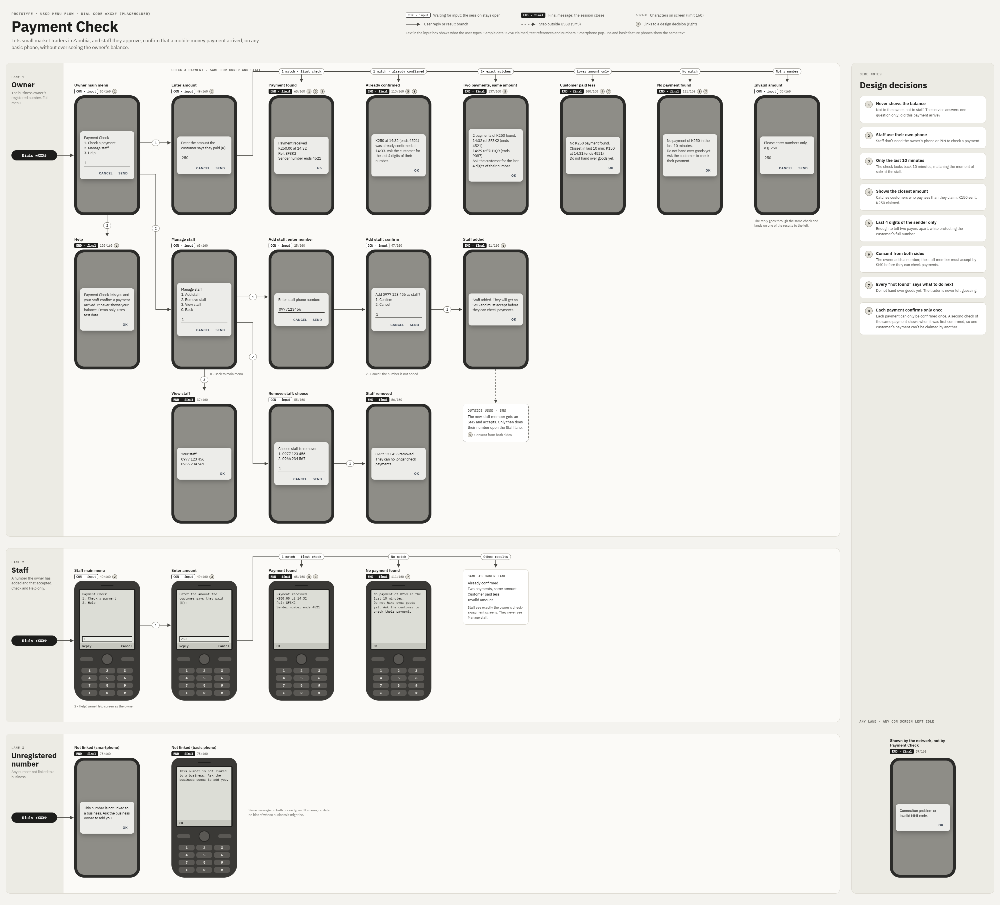
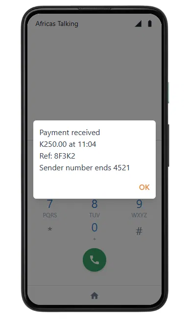
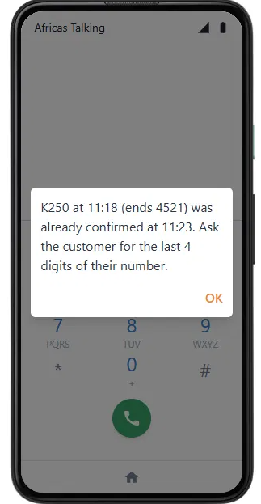
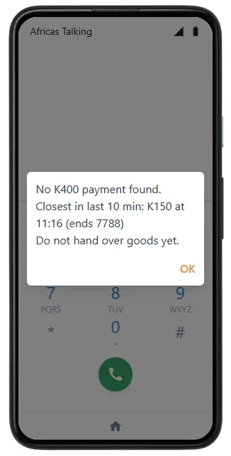
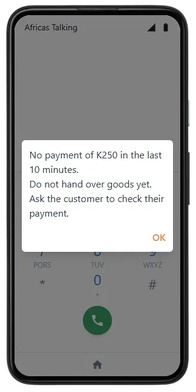
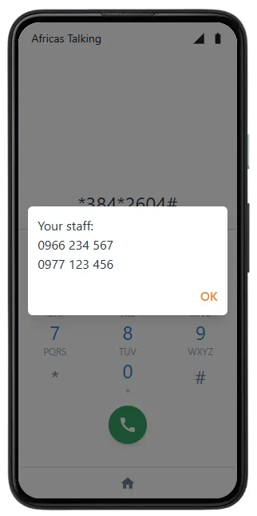
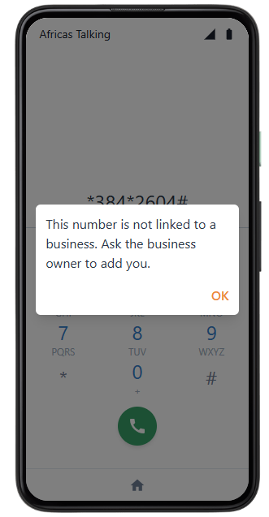

# Merchant Payment Verification in Zambia

**A prototype that lets market traders, and their staff, check a mobile money payment themselves in seconds, on any phone, without exposing their balance.**

> **Status: in progress.** This repository is being built in stages. The sections below mark what exists now and what is planned. Nothing here is live on a real mobile money network.

> **Disclaimer:** This is an independent, unaffiliated, educational prototype. MTN, MoMo, MoMoPay, Airtel Money, M-PESA and related marks are trademarks of their respective owners. This project is not endorsed by or affiliated with any mobile money operator. It uses only synthetic data and public datasets, never real customer transactions.

---

## The problem

In markets across Zambia, small traders often confirm a mobile money payment by looking at the **customer's** phone, not their own. That makes them easy targets: a customer can show an edited screenshot or an old confirmation message and walk away with the goods.

Why don't merchants just check their own phone?

- The confirmation SMS usually goes only to the **owner's** phone, so staff at the stall can't see it
- Checking the balance takes several steps and a PIN, in the middle of a busy sale
- SMS can arrive late
- The confirmation message shows the merchant's **balance** to anyone looking at the phone

A 2026 study of 30 Rwandan business owners, managers and employees ([Adewusi et al., USENIX Security 2026](https://www.usenix.org/conference/usenixsecurity26/presentation/adewusi)) found that 17 of the 30 relied on customers' phones to verify payments in at least some situations. I saw the same pattern in Kitwe, which I wrote up in a [product case study](https://taonga.super.site).

## What already exists (prior art)

This problem is **partly solved**, and this project builds on that work rather than claiming to be first:

- **Safaricom M-PESA, Kenya.** Business tills have their own notification number, and [Split Notifications (M-PESA Jumbe)](https://www.safaricom.co.ke/media-center-landing/frequently-asked-questions/split-notifications-m-pesa-jumbe-faqs) send nominated staff a short SMS for every payment, with no balance shown. This is the closest existing solution.
- **The USENIX researchers' proposal.** Redesign the customer's confirmation screen to remove private information and add a secret known only to the merchant.
- **Online payment gateways** (Flutterwave, Paystack, pawaPay and others) verify payments for businesses with websites or software, but not for a trader with a basic phone.

**The gap this project targets:** small traders in markets like Zambia who use a personal wallet, have no way to add staff, and whose confirmation SMS still shows their balance.

## What this prototype does

A USSD flow, the menu system people reach by dialling a code like `*123#`, that works on any phone without internet:

1. The owner approves a staff member's number once
2. A customer says they've paid K250
3. The staff member dials the code and enters the amount
4. The screen shows **"Payment received: K250 at 14:32, ref 8F3K2"** or **"No matching payment in the last 10 minutes"**
5. No balance is shown, and no owner PIN is needed

In this prototype, payments come from a **simulated ledger of synthetic transactions**, not a real mobile money network. The point is to show the product flow working end to end, not to connect to a real operator.

### Menu design



Every screen fits within the 160-character USSD limit. The key design decisions:

- **Never shows the balance**, to anyone
- **Staff don't need the owner's phone or PIN**, and must accept an invitation before they can check payments
- **Only checks the last 10 minutes**, matching the moment of sale
- **Each payment can only be confirmed once**, so one customer's payment can't be claimed by another
- **Shows the closest lower amount**, to catch customers who pay less than they claim
- **Shows only the last 4 digits** of the sender's number, to protect customer privacy
- **Every "not found" screen says what to do next**: don't hand over the goods

## See it working

Tested end to end on the Africa's Talking USSD sandbox simulator, with the app deployed on Render.

| Payment received | Already confirmed | Customer paid less |
| --- | --- | --- |
|  |  |  |
| Staff confirm a payment without seeing the balance | A second check of the same payment is flagged | The closest real payment is shown instead |

| No payment found | Owner's staff list | Unregistered number |
| --- | --- | --- |
|  |  |  |
| Nothing in the last 10 minutes | Only the owner can manage staff | Unknown numbers get no access |

## How it works

When someone dials the code, Africa's Talking sends the app the session ID, phone number and everything typed so far. The app replies with text starting with `CON` (show a menu and wait) or `END` (show a final message and close). The whole flow lives in [`app.py`](app.py), and the core logic is in `check_payment()`.

### Run it yourself

```
pip install -r requirements.txt
pytest                 # 27 tests covering every screen
python app.py
```

Then, in another terminal:

```
curl -X POST localhost:5000/ussd -d "phoneNumber=+260970000001&text=1*250"
```

Demo helpers: `POST /demo/pay` adds a test payment, `POST /demo/accept` accepts a staff invitation, and `POST /demo/reset` restores the starting data.

## Scope

### Version 1 (this repository)

| Component | What it is | Status |
| --- | --- | --- |
| Spec and README | This document: problem, prior art, scope | ✅ Done |
| USSD prototype | Merchant and staff check flow, deployed on Render and tested on the [Africa's Talking](https://africastalking.com) USSD sandbox | ✅ Done |
| Simulated ledger | Synthetic payments the USSD flow checks against, reset on each restart | ✅ Done |
| Tests | 27 automated tests, one for each screen and edge case | ✅ Done |
| Web demo page | A clickable phone in the browser, so anyone can try the flow without an account | 🔜 Planned |
| Dashboard | Public data on mobile money and merchant payment growth, showing why the problem matters | 🔜 Planned |

### Later versions

| Component | Why it's later |
| --- | --- |
| Fraud detection model | A model trained on synthetic mobile money data ([PaySim](https://www.kaggle.com/datasets/ealaxi/paysim1)) plus my own scenarios for fake-confirmation fraud. Valuable, but not needed to show the product works |
| Data pipeline | Loading public data into a warehouse with dbt and orchestration. Useful for the dashboard at scale, not for V1 |

### Out of scope

- Running on a real operator's network. That needs operator approval, fees and a real shortcode
- Connecting to any live mobile money API
- Recruiting real users or handling real money
- A mobile app

## How I'll know V1 works

- Anyone can open the web demo and complete the check flow in **under 30 seconds** (planned)
- ✅ The flow correctly returns "received", "already confirmed", "paid less" and "not found" for test payments
- ✅ Staff can check a payment **without** seeing the owner's balance
- A reader with no background understands the problem and the demo from this README alone

## Responsible disclosure

This project describes the fraud pattern at a conceptual level only. It does not include tools, templates or instructions for creating fake confirmations, and it never uses real confirmation messages or customer data.

## Data

- **Synthetic only** for transactions: PaySim (freely licensed) and data I generate myself
- **Public data** for the dashboard: [World Bank Global Findex](https://www.worldbank.org/en/publication/globalfindex), [IMF Financial Access Survey](https://data.imf.org/fas), [GSMA Mobile Money Metrics](https://www.gsma.com/mobilefordevelopment/mobile-money/mobile-money-metrics/) and Bank of Zambia reports, used under their terms
- **Never** real customer transactions or real SMS messages

## Limitations

- This is a portfolio prototype, not a product. It shows a product idea working, not that it would succeed at scale
- Payments are synthetic and stored in memory, so they reset whenever the app restarts, and there is one demo business
- The sandbox simulator needs an Africa's Talking account, so the web demo page is how others will try it
- A real version could only be built by a mobile money operator, since it needs live transaction data
- My understanding of the problem comes from informal observation and published research, not a formal user study

## About

Built by **Taonga Soko**, a data analyst in Kitwe, Zambia, interested in products for emerging markets.
Portfolio: [taonga.super.site](https://taonga.super.site)

## References

- Adewusi, O. A., et al. (2026). *Security and Privacy Considerations for Confirming Payments in Rwandan Mobile Money Systems.* 35th USENIX Security Symposium.
- Safaricom. *Split Notifications (M-PESA Jumbe) FAQs.*
- Lopez-Rojas, E., Elmir, A., & Axelsson, S. (2016). *PaySim: A financial mobile money simulator for fraud detection.*